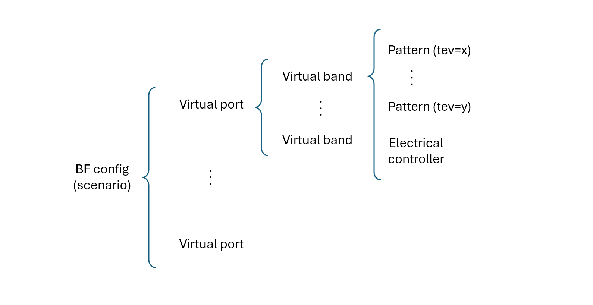

# Generador de modelos de antena beamforming (.pafx)

---

### Aplicación

Este módulo permite generar un modelo de antena con soporte de beamforming usando la siguiente estructura:



### Instalación

1. Instalar un intérprete de Python 3.10 o superior.
2. Ejecutar en el directorio raíz:

```
$ pip install -r requirements.txt
```

3. Se requiere además contar con un IDE que soporte Jupyter Notebooks.

### Datos de input

Se requieren como inputs:

1. Un conjunto de archivos de patterns .msi dentro de una estructura de archivos provista por el fabricante
2. Parámetros adicionales (marca, modelo, dimensiones y peso, cantidad y espaciamiento de elementos horiz./vert., etc.)

### Modo de uso

Se provee una serie de clases que procesan todos los inputs de acuerdo a una configuración específica.

Los parámetros de configuración tienen el siguiente formato:

```
{
    # ------------------------------------------------------------------
    # Parámetros generales
    # ------------------------------------------------------------------
    'src_folder': str,
    'pattern_file_format': str,
    'version': str,
    'filename': str,
    'name': str,
    'type': str,
    'comment': str,
    'manufacturer': str,
    'cost': number,
    'cost_unit': str,
    'length_cm': number,
    'width_cm': number,
    'depth_cm': number,
    'weight_kg': number,
    'wind_load_factor': number,
    'supp_elec_tilt': bool,
    'supp_elec_azimuth': bool,
    'supp_elec_beamwidth': bool,
    'cont_adj_elec_tilt': bool,
    
    
    # ------------------------------------------------------------------
    # Filtro general (allow/deny) de archivos de patterns a considerar
    # ------------------------------------------------------------------
    'src_file_re_filter': ReFilter,
    
    
    # ------------------------------------------------------------------
    # Extractores de parámetros
    # ------------------------------------------------------------------
    'pattern_name_extractor': ParamExtractor,
    'scenario_extractor': ParamExtractor,
    'v_port_name_extractor': ParamExtractor,
    'pattern_type_extractor': ParamExtractor,
    'center_freq_extractor': ParamExtractor,
    'min_freq_extractor': ParamExtractor,
    'max_freq_extractor': ParamExtractor,
    'electrical_tilt_extractor': ParamExtractor,
    'polarization_extractor': ParamExtractor,
    'polarization_type_extractor': ParamExtractor,
    'v_port_number_of_ports_extractor': ParamExtractor,
    'horiz_number_of_elements_extractor': ParamExtractor,
    'horiz_sep_dist_cm_extractor': ParamExtractor,
    'vert_number_of_elements_extractor': ParamExtractor,
    'vert_sep_dist_cm_extractor': ParamExtractor,
}
```

#### Parámetros generales:

No están incluidos dentro de los archivos de patterns, por lo que deben solicitarse al proveedor

#### Filtro general (allow/deny) de archivos de patterns a considerar:

Es un filtro versátil que soporta múltiples condiciones de whitelist y de blacklist usando expresiones regulares.
Permite hacer un filtro general inicial para quedarse únicamente con los archivos de pattern que formarán parte del
modelo final.

#### Extractores de parámetros:

Cada extractor tiene como función obtener para cada pattern un parámetro específico: nombre, scenario, nombre de virtual
port, frecuencias, tilt eléctrico, etc.

Existen dos tipos de extractores:

#### 1. PatternNameParamExtractor

> Extrae el parámetro de la ruta completa del archivo de pattern. Tiene los siguientes argumentos de configuración:
> - **extract_re:** Expresión regular que captura un valor usando un grupo de captura con nombre **&lt;cg&gt;**.
    Ejemplo: ```.*_(?P<cg>-?\d+)T_.*```. Documentación de
    python: https://docs.python.org/3/howto/regex.html#non-capturing-and-named-groups
> - **path_part:** Parte de la ruta de archivo que usaremos. Puede ser ***full*** (por defecto, ruta completa),
    ***basename*** (nombre de archivo sin el directorio), o ***dirname*** (directorio sin el nombre de archivo).
> - **pre_capture_proc:** Función que transforma opcionalmente el nombre de archivo antes de ejecutar la captura por
    regex.
> - **post_capture_proc:** Función que transforma opcionalmente el valor capturado por regex.

#### 2. PatternPayloadParamExtractor

> Extrae el parámetro del contenido del archivo de pattern. Tiene el siguiente argumento de configuración:
> - **extract_fn:** Función que toma como argumento un objeto MsiData con los contenidos del archivo .msi y lo procesa
    según sea necesario. El formato del objeto MsiData es el siguiente:
> ```
> class MsiData:
>   src_file: str
>   header: dict
>   boresight_gain: float
>   boresight_gain_unit: str
>   horiz_beamwidth_deg: float
>   vert_beamwidth_deg: float
>   horiz_boresight_deg: int
>   vert_boresight_deg: int
>   front_to_back_ratio_db: float
>   horiz_pap_pattern: PapPatternData
>   vert_pap_pattern: PapPatternData
>
> class PapPatternData:
>     inclination: int
>     orientation: int
>     start_angle: int
>     end_angle: int
>     step: int
>     gains: list[float]
> ```

### Generación del modelo .pafx usando Jupyter Notebooks

Se proveen en la carpeta **antenna_scripts** un conjunto de Jupyter Notebooks, una para cada modelo de antena, a modo de
ejemplo.

Cada notebook se ejecuta en cuatro pasos:

1. Importación de paquetes
2. Configuración del generador
3. Log de parámetros capturados (simple o detallado)
4. Generación del modelo final .pafx y log de asignaciones de *Scenario > Virutal port > Virutal band > Pattern*

Los archivos .pafx generados se colocan en la carpeta **output**.